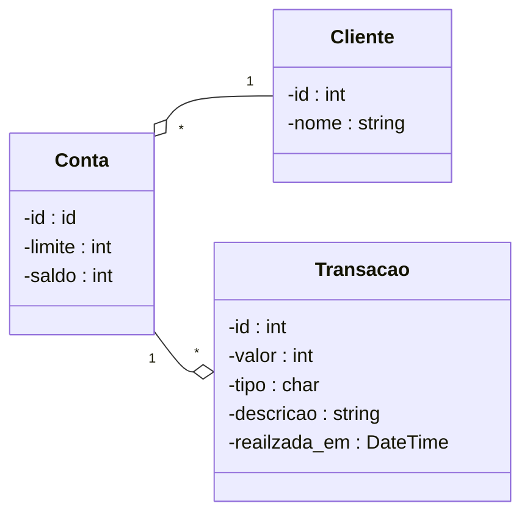

# Model Diagram

```mermaid
classDiagram
  direction LR
  class Conta {
    -id : id
    -limite : int
    -saldo : int
  }
  class Cliente{
    -id : int
    -nome : string
  }
  class Transacao{
    -id : int
    -valor : int
    -tipo : char
    -descricao : string
    -reailzada_em : DateTime
  }
  Conta "*" o-- "1" Cliente
  Conta "1" --o "*" Transacao
```
