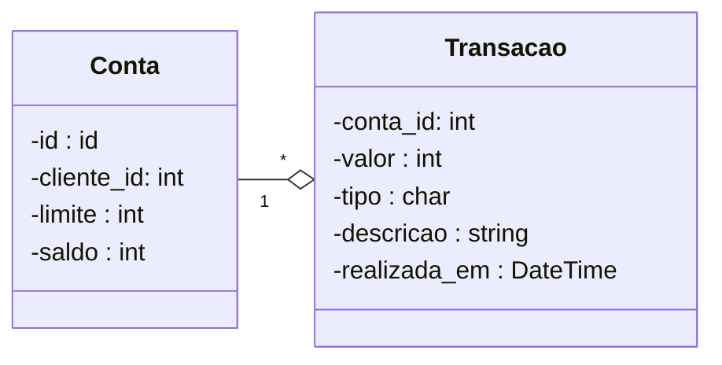

# Model Diagram

## Diagram



## Entrypoint SQLs

```sql

create table contas (
   id int primary key,
   cliente_id int not null,
   limite bigint not null,
   saldo bigint not NULL
);

CREATE UNIQUE INDEX idx_cliente_conta ON contas (cliente_id);

create index idx_conta on contas (cliente_id, id, limite, saldo);


create table transacoes (
   conta_id int not null,
   valor bigint not null,
   tipo char(1) not null,
   descricao varchar(10) not null,
   realizada_em datetime not null,
   foreign key (conta_id) references contas(id)
);

CREATE INDEX idx_conta_transacao ON transacoes (conta_id);

create index idx_transacao on transacoes (conta_id, valor, tipo, descricao, realizada_em);

CREATE TRIGGER ins_transacao AFTER INSERT ON transacoes
FOR EACH ROW
BEGIN
  UPDATE contas
  SET saldo = saldo + (NEW.valor * (CASE WHEN NEW.tipo = 'd' THEN -1 ELSE 1 END))
  WHERE id = NEW.conta_id;
END;


DELETE from contas WHERE id >= 1;

insert into contas (id, cliente_id, limite, saldo)
values
(1, 1,   100000, 0),
(2, 2,    80000, 0),
(3, 3,  1000000, 0),
(4, 4, 10000000, 0),
(5, 5,   500000, 0);


```
