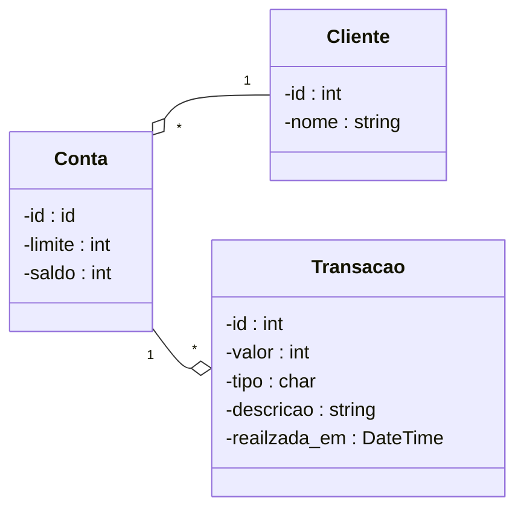

# Model Diagram

## Diagrama



## Entrypoint SQLs

```sql

create table cliente (
   id int not null auto_increment,
   nome varchar(100) not null,
   primary key (id)
);


create table conta (
   id int not null auto_increment,
   cliente_id int not null,
   limite bigint not null,
   saldo bigint not null,
   primary key (id)
);

alter table conta add foreign key (cliente_id) references cliente(id);

create index idx_conta on conta (cliente_id, limite, saldo);


create table transacao (
   id int not null auto_increment,
   conta_id int not null,
   valor bigint not null,
   tipo char(1) not null,
   descricao varchar(20) not null,
   realizada_em datetime not null, -- DEFAULT CURRENT_TIMESTAMP,
   primary key (id)
);

alter table transacao add foreign key (conta_id) references conta(id);

create index idx_transacao on transacao (conta_id, valor, tipo, descricao, realizada_em);


insert into cliente (nome)
values
('Milionario'),
('Jose Rico'),
('Dinheirudo'),
('Pobrecito'),
('Gastao');

insert into conta (cliente_id, limite, saldo)
values
(1,   100000, 0),
(2,    80000, 0),
(3,  1000000, 0),
(4, 10000000, 0),
(5,   500000, 0);


```
